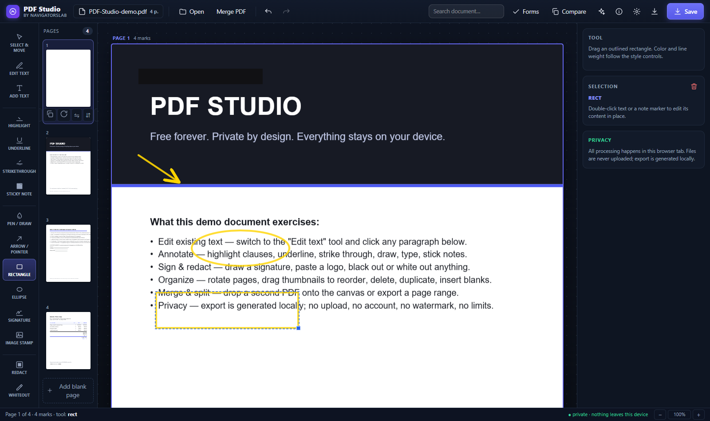
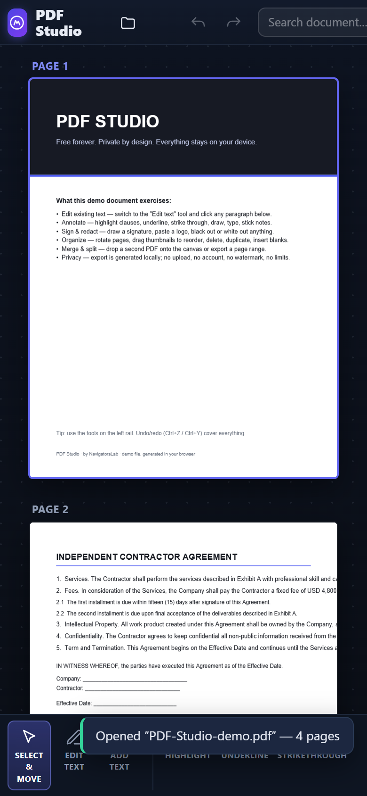

# PDF Studio — hands-on walkthroughs

Step-by-step guides for every feature, each with a real screenshot captured from the running app.
Try everything yourself in the [live app](https://navigatorslab.com) — it's free, open source, and
nothing you open ever leaves your device.

---

## 1 · Edit the text that is already in the PDF

The flagship. Most editors only stamp new text on top; PDF Studio **rewrites the original at the
content-stream level** — the old glyphs' operators are deleted from the file itself.

1. Open any digital PDF (one with selectable text — not a scan).
2. Pick the **Edit text** tool in the left rail.
3. Every line of the original text glows as a clickable target — and **table rows light up per
   cell**, so an invoice's Reference / Recipient / Amount columns are independent targets:


4. Click a line (or one cell), retype it, press Enter. On export, PDF Studio splices the page's
   content stream: the original text operators are **removed from the file** and your replacement
   is written in as real vector text at the same position and size, with kerning that reproduces
   the original column spacing — searchable, selectable, and unrecoverable in its original form:


   Want proof? Export a file after an edit and search the bytes for any word of the original line —
   it is not there. (Lines in exotic subset/CID fonts keep a page-sampled cover fallback, since
   their glyph ids cannot be safely re-encoded; everything else is a true rewrite.)

On export the replacement is real vector text — searchable, selectable, print-crisp.

> Scanned page with no text layer? Skip to walkthrough 9 (OCR).

## 2 · Fill PDF forms (AcroForms)

1. Open a fillable PDF → press **Forms** in the top bar.
2. Every field is listed — text, checkbox, radio group, dropdown — with jump-to-page buttons.


3. Toggle **"show fields on pages"** to draw the widgets on the page itself; clicking one scrolls
   the dialog to it and focuses that field:


4. **Save** writes values into the real fields; **flatten** burns them into page content so they
   can't be changed downstream.

## 3 · Sign, stamp, annotate

- **Signature**: pick the Signature tool, click where it should go, draw on the pad
  (exported as a transparent PNG), confirm:


- **Highlight / underline / strikethrough / pen / sticky notes / text boxes / image stamps** — every mark
  lives in true PDF coordinates and exports as real content:


- **Styling shapes**: **Arrow / pointer** (drag tail → tip; the arrowhead lands at release),
  **Rectangle** and **Ellipse** outlines — color and line weight follow the style controls:



## 3b · Redact sensitive content

Pick **Redact**, drag over what must not be seen. The box is opaque black on canvas and is
flattened black-over-content in the exported file — the covered content stays hidden in the
shipped PDF. Prefer invisible cleanup on scans? **Whiteout** covers with the page-sampled
background instead.

## 4 · Organize pages

Drag thumbnails to reorder; rotate, duplicate, delete, or insert blanks from each thumbnail's
controls; **Merge** another PDF at any position (or drop a file on the canvas); **Save** can
extract any range (`1-3,5`) or emit one file per page.


Sideways scans get a one-click, undoable **"Turn upright"** banner — for 90°, 180°, and 270°
camera-rotation metadata alike. Mirrored artwork (a generator bug that shows in *every* viewer)
is fixed with per-page horizontal/vertical flip — the export mirrors the real content while your
marks stay put.

## 5 · Stamp page numbers, watermarks, headers & footers

In the **Save** dialog: page numbers (position, `1` / `Page 1` / `1 of N`, custom first number,
skip-cover), a diagonal watermark with size/opacity/color, and header/footer lines with
`{page}` `{pages}` `{date}` `{title}` tokens — all rendered at true PDF coordinates.


## 6 · Search everything

Type in the top-bar search box. Matches are highlighted on every page; Enter / Shift+Enter cycle
through them with a live counter.


## 7 · Compare two PDFs

Press **Compare**, drop two files, read the diff — additions green, removals red, with per-page
counts. Built for "did the contract terms change between versions?"


## 8 · Ask an AI — privately

The ✦ assistant runs Qwen2.5 0.5B / Llama 3.2 1B **in your browser** (WebLLM/WebAssembly).
Summarize, ask questions, extract text. The document never leaves the device; weights download
once and work offline afterwards. **Extract text** needs no download at all.


## 9 · OCR a scanned page

Edit-text tool → **OCR this page**. Tesseract runs locally in WASM; each recognized line becomes
a real editable text box (background sampled from the page), so exports turn flat scans into clean
vector text. One-time ~15 MB language download, cached after.

## 10 · Edit on your phone

Open the app on a phone: the tool rail docks to the **bottom of the screen** (thumb-reachable,
labels under each icon), the top bar scrolls horizontally, and pages stack full-width. Install it
as a PWA for a fullscreen, offline-capable editor:



## 11 · Resume where you left off

Everything autosaves on-device. After a refresh or crash, the start screen offers to restore the
whole session — files, page ops, marks, and form values:


---

## For developers

```bash
npm install
npm run dev        # http://localhost:5199
npm test           # 24 tests
npm run typecheck
npm run build      # → dist/ (PWA service worker included)
```

The screenshots in this folder are regenerated with `node scripts/capture.cjs` (expects the app
serving on `:5198` — used by `scripts/subpath-server.cjs`).

Geometry invariant: **all marks live in the page's PDF user space**; the overlay and the exporter
share the same CropBox-aware transform (`src/lib/viewport.ts`), pinned against pdf.js's own
`PageViewport` in tests — including offset MediaBox/CropBox origins that displace clicks in most
home-grown editors.

Free & open source under MIT — fork it, self-host it, ship it.
