<div align="center">

# PDF Studio

### The free, open-source PDF editor that edits the text *inside* your PDF — entirely in your browser.

**No uploads · No accounts · No watermarks · No page limits · No catches**

[](https://navigatorslab.com)
[](https://kayforkind.github.io/NavigatorsLab-PDF-Studio/)
[](./LICENSE)
[](#developer-quick-start)

*A [NavigatorsLab](https://navigatorslab.com) project.*

</div>

---

> **The pitch, in one sentence:** PDF Studio is the PDF editor you keep trying to find and never find — one that actually rewrites the text already in the document, fills real forms, OCRs scans, signs, redacts, reorganizes pages, diffs two revisions, and answers questions about the file with an on-device AI — and it does all of it **without your document ever leaving your computer**, for **free**, as **open source (MIT)**.

## Why this exists

Every "free" PDF editor online hits you the same way: upload your contract or your ID to somebody's server, edit three pages, then hit a paywall, a watermark, a page cap, or a sign-up screen at the exact moment you press Save. Desktop editors that genuinely modify existing text cost money or lock the feature behind a subscription.

**PDF Studio's answer:** a full editor that runs 100% client-side. Your files are opened, edited, and saved by your own browser, on your own machine. There is no server to upload to. There is no account. There is no watermark, no quota, no "pro" tier. It is MIT-licensed open source — fork it, self-host it, ship it.

## What it actually does (with proof)

Every claim below is demonstrated by a real screenshot in this repository, captured from the running app.

### ✏️ Edits the text that is already in your PDF

The feature other "editors" fake. Pick the Edit tool and every line of the original text lights up as a clickable target. Click a line, retype it, done — the old glyphs are painted over with a **background color sampled from the page itself** (so it works on scanned or textured pages, not just white), and your replacement is stamped at the same position and size. On export it's real vector text in real PDF content, not a screenshot pasted on top.

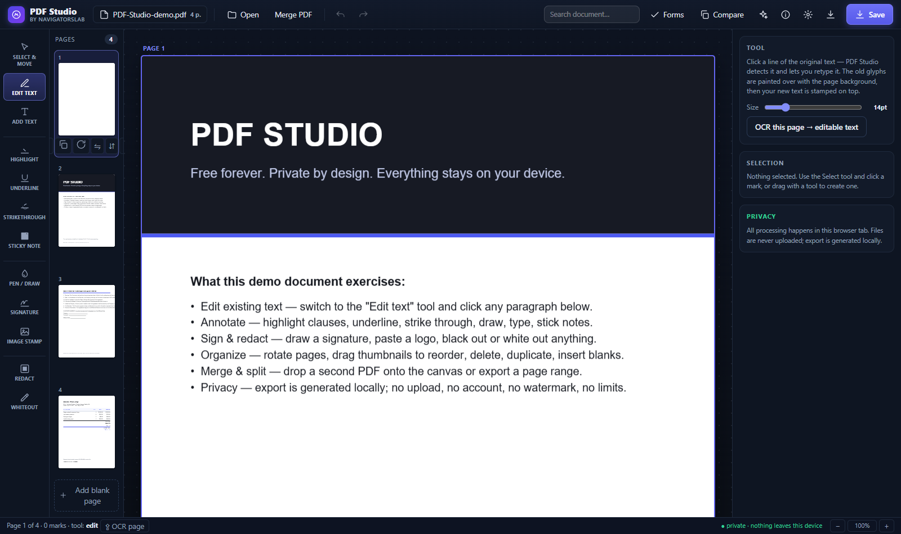

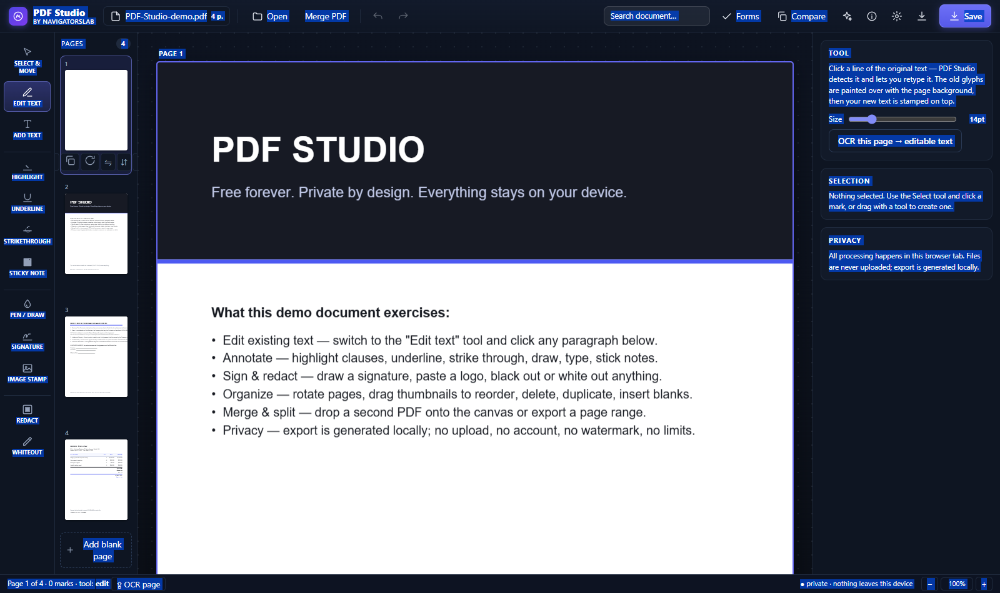

- Works on any digital PDF with a text layer, at any zoom level
- Hover hints show exactly what's editable before you commit
- Exports as true vector text — searchable, selectable, print-crisp

### 📝 Fills real PDF forms (AcroForms) — then flattens them

Open a fillable PDF and the Forms dialog lists **every field**: text inputs, checkboxes, radio groups, dropdowns — with jump-to-page buttons. Type your values right in the list, or flip on "show fields on pages" and click the widgets directly on the page canvas. On save, values are written into the *real* form fields — or **flattened** into page content so nobody downstream can change them. Tax forms, applications, contracts: filled privately, on your machine.

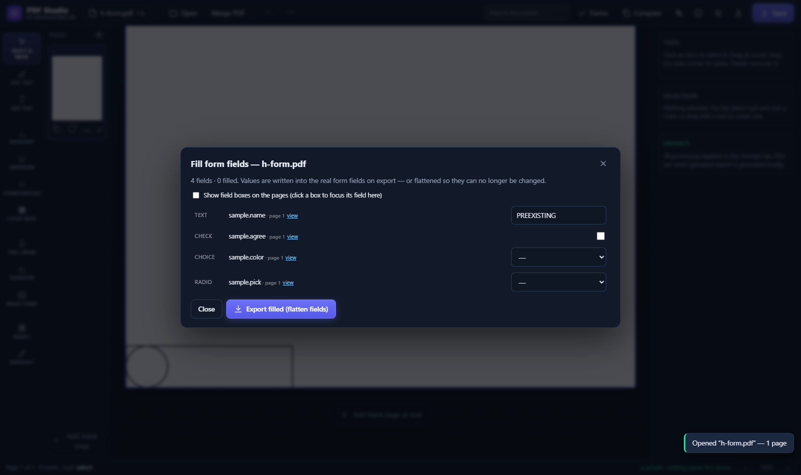


### 🖋️ Signs, stamps, annotates

Draw your signature on the built-in pad (exported as a transparent PNG), place it anywhere, resize it. Highlight, underline, strike through, freehand pen, sticky notes, text stamps, image stamps — every mark lives in true PDF coordinates and exports as real content.

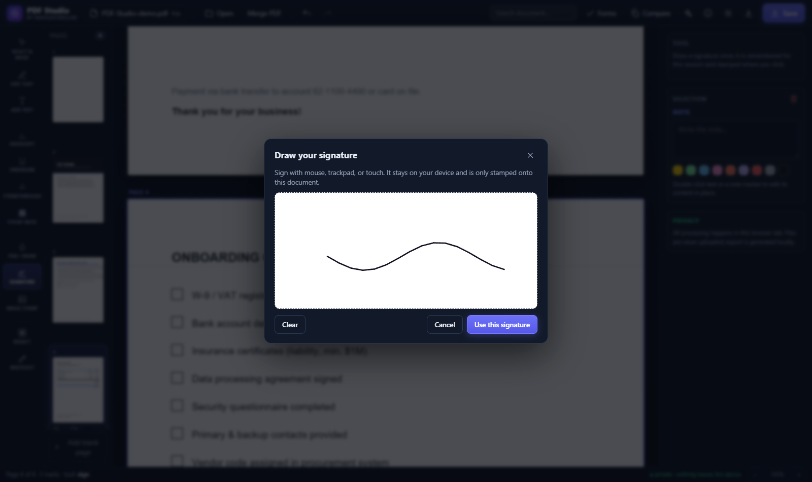

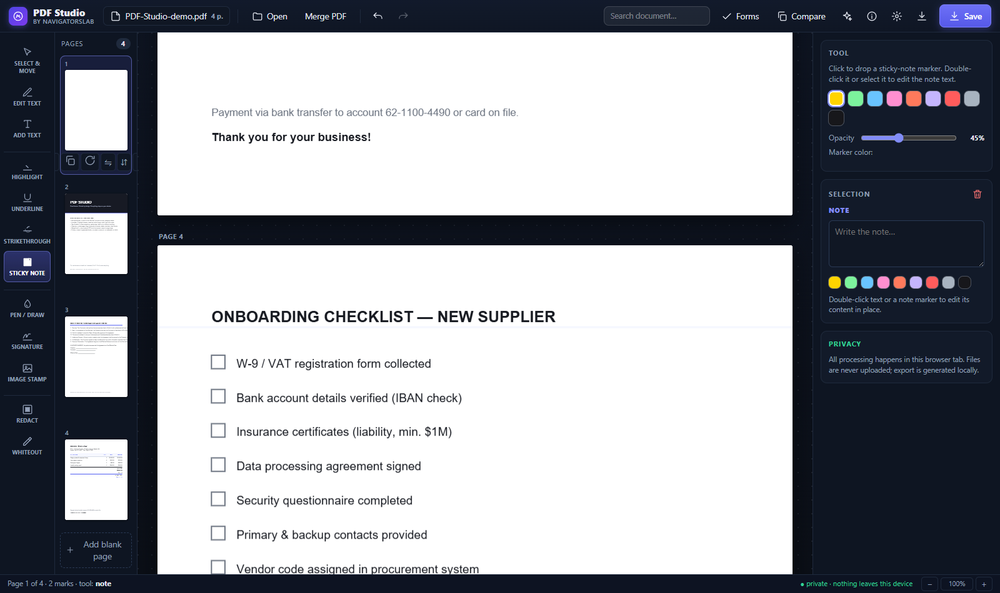

### 📄 Reorganizes pages like a pro

Drag thumbnails to reorder. Rotate 90° (honoring the file's own rotation metadata — with a one-click **"Turn upright"** banner when a file was scanned sideways). Duplicate, delete, insert blank pages. **Merge** another PDF at any position — or just drop a file onto the canvas. **Split** by page range (`1-3,5`) or explode to one-file-per-page.

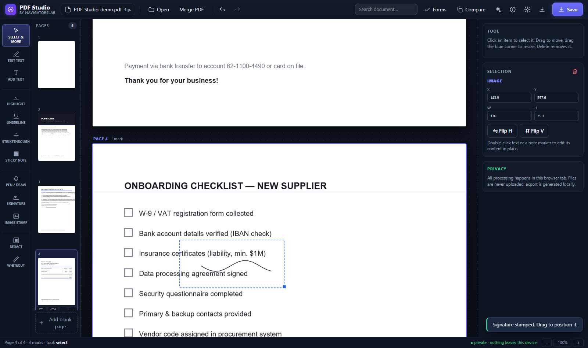

### 🔢 Stamps page numbers, watermarks, headers & footers

At export time: page numbers (position, `1` / `Page 1` / `1 of N` formats, custom first number, skip-the-cover), diagonal watermarks with size/opacity/color, and header/footer lines with `{page}`, `{pages}`, `{date}`, `{title}` tokens. Rendered at true PDF coordinates — crisp at any zoom.

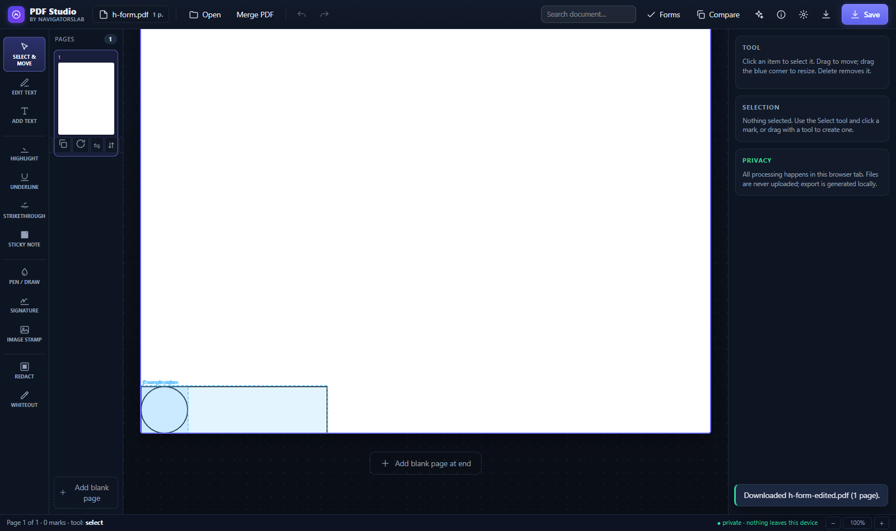

### 🔍 Searches the whole document

Full-text search across every page, case-insensitive, with highlighted matches on the page and Enter/Shift+Enter navigation with a live counter.

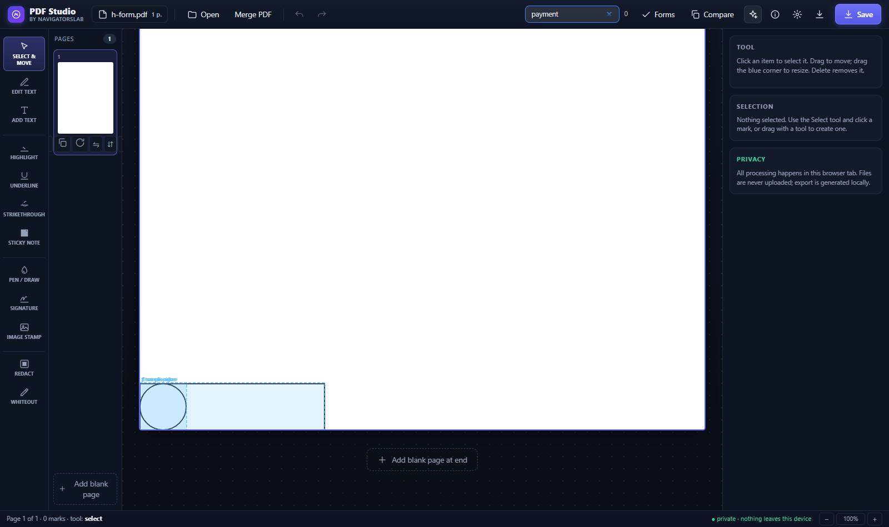

### ⚖️ Diffs two PDFs line by line

Drop two versions of a document into Compare and get an LCS line-diff of their extracted text — additions in green, removals in red, per-page counts. Did the payment terms change between v1 and v2? Now you know in seconds.

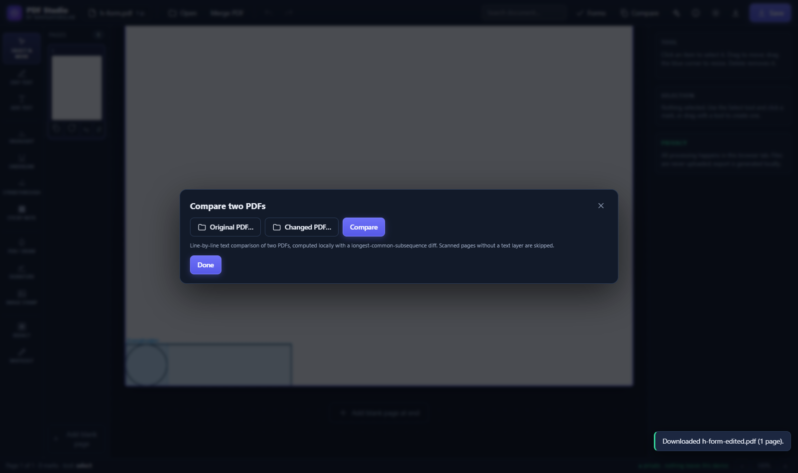

### 🤖 Asks an AI about your document — without leaking it

The ✦ assistant runs a real LLM (Qwen2.5 0.5B / Llama 3.2 1B) **in your browser via WebAssembly**. Ask questions, get summaries. The document text never leaves the device — the model comes to your data, not the other way around. Weights download once (~0.6–0.9 GB), then work offline. The lighter **Extract text** path needs no download at all and runs fully offline.

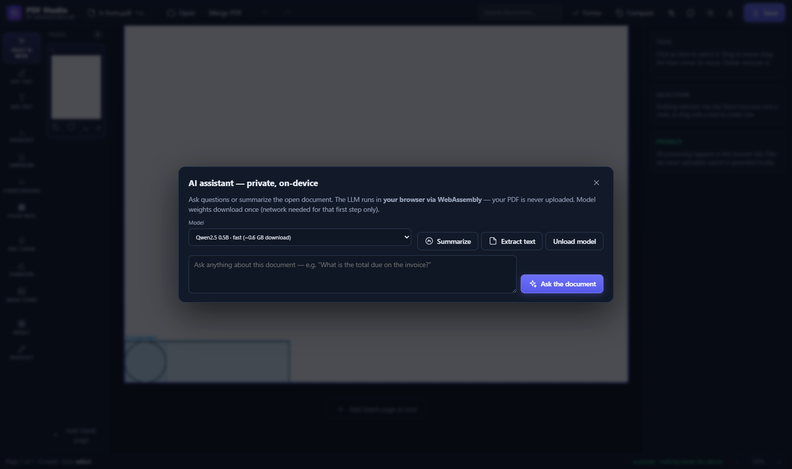

### 🔠 OCRs scanned pages into editable text

Scanned page with no text layer? The OCR tool runs **Tesseract locally in WebAssembly** — each recognized line becomes a real, editable text box whose background is sampled from the page, so the export turns a flat scan into clean vector text. One-time ~15 MB language download, cached forever after.

### 🩹 Repairs broken files

- **Sideways scans**: detects camera-style rotation metadata and offers a one-click, undoable "Turn upright" for every affected page — including files stuck at 180°.
- **Mirrored content**: some generators store artwork flipped (your email print-to-PDF might be upside down in *every* viewer). Flip any page horizontally/vertically — the export mirrors the real page content while your marks stay put.
- **Offset page boxes**: PDF Studio's geometry engine is **CropBox-aware** — it handles files whose MediaBox doesn't start at (0,0) (extremely common in print-to-PDF output) that displace clicks and annotations in lesser editors.

### 💾 Never loses your work

Everything — open files, page operations, marks, form values — autosaves to on-device storage. After a crash or refresh, the start screen offers **Resume session**, and picks up exactly where you left off.

### 📴 Works offline

It's a PWA: install it to your dock/desktop and it keeps working with the network off. Your toolkit shouldn't have an "out of service" state.

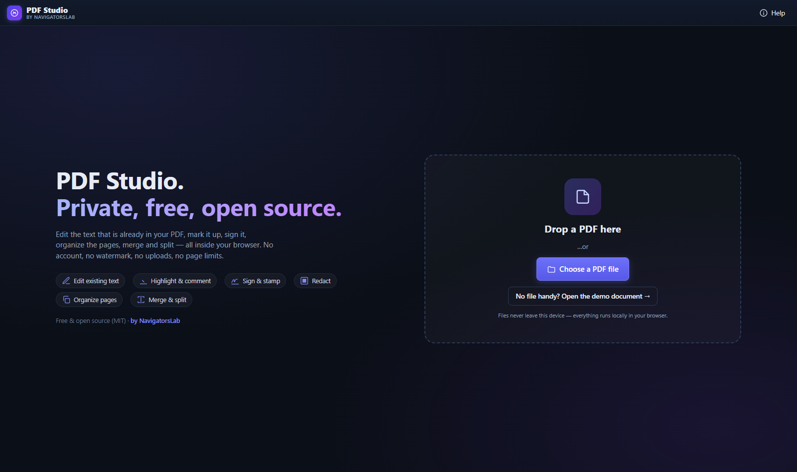

## Privacy model — short and absolute

| Question | Answer |
| --- | --- |
| Where do my files go? | **Nowhere.** There is no upload endpoint. Open the devtools network tab and watch it stay silent while you edit. |
| Do I need an account? | **No.** There is no server to have an account on. |
| Watermarks? | **None.** |
| Page/task/hour limits? | **None.** |
| What downloads over the network? | The app itself, plus optional public model weights (AI ~0.6 GB, OCR ~15 MB) — cached by your browser after the first fetch. Your *documents* never transit the network. |
| Can I air-gap it? | **Yes.** Clone the repo, host `dist/` on an internal network, point the AI/OCR loaders at internal mirrors. |

## The honest limits (we'd rather tell you than oversell)

- Edit-text targets PDFs **with a text layer**; for flat scans you use the OCR tool (which exists precisely for that).
- Replacement text is set in Helvetica metrics — extremely close, but not glyph-identical to exotic embedded fonts.
- Compare diffs extracted **text**, not rendered pixels — it's built for contract/revision review, not detecting a shifted logo.
- The AI runs small models (0.5B–1B parameters) — good at summarizing and locating content in a document, not a replacement for a frontier model.

## Developer quick start

```bash
git clone https://github.com/Kayforkind/NavigatorsLab-PDF-Studio
cd NavigatorsLab-PDF-Studio
npm install
npm run dev        # http://localhost:5199 → click "Open the demo document"
npm test           # 24 unit + integration tests
npm run typecheck
npm run build      # production build + PWA service worker → dist/
```

**Stack:** TypeScript · React 19 · Vite · pdf.js (render) · pdf-lib (write) · Tesseract.js (OCR) · WebLLM (AI) · vite-plugin-pwa. Zero backend.

**Architecture in one line:** every mark lives in the page's PDF user space; the on-screen overlay and the exporter share the same CropBox-aware transform math (`src/lib/viewport.ts`), pinned in tests against pdf.js's own `PageViewport` — including offset MediaBox/CropBox origins that break most home-grown editors.

**Test suite (24):** document model ops & undo semantics · viewport parity with pdf.js at 0/90/180/270° · real export round-trips re-parsed with pdf.js (rotation, blanks, flattened annotations, form flattening, stamps) · LCS diff engine.

## Deployment (any static host, one command)

```bash
npm run build   # → dist/
```

The build uses a **relative base**, so the same `dist/` works at a domain root, a subpath (`/repo-name/`), or a CDN — verified under a simulated GitHub Pages subpath. A GitHub Actions workflow (`.github/workflows/deploy-pages.yml`) publishes to Pages on every push to `main`; `wrangler.jsonc` deploys to Cloudflare Workers (`navigatorslab.com`) with `npx wrangler deploy`.

## License

**MIT** — free for personal, commercial, and everything-in-between use. That's the whole point: [LICENSE](./LICENSE).

<div align="center">

**Free. Open source. Private by architecture, not by policy.**

[navigatorslab.com](https://navigatorslab.com) · [use it live](https://navigatorslab.com) · [GitHub Pages mirror](https://kayforkind.github.io/NavigatorsLab-PDF-Studio/)

</div>
