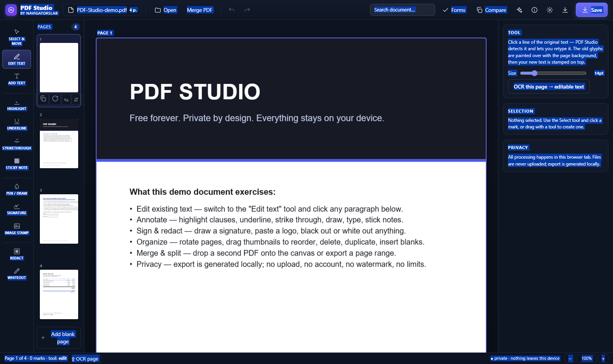
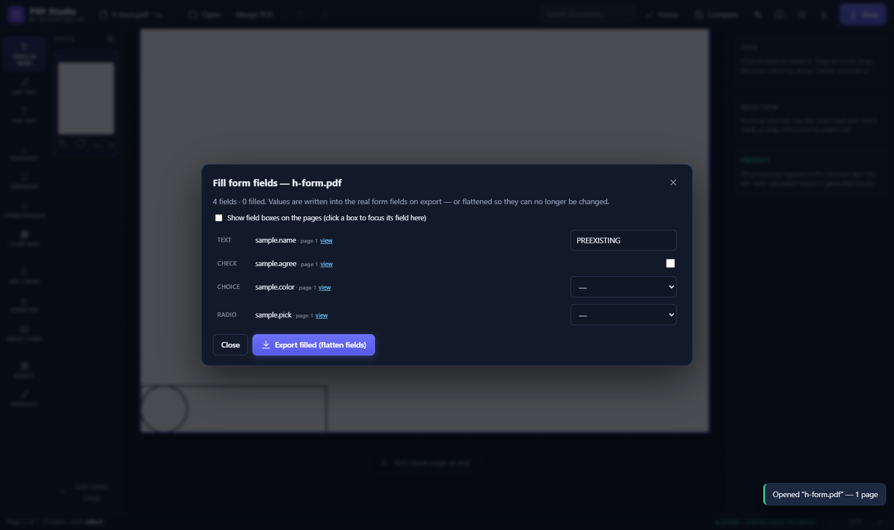
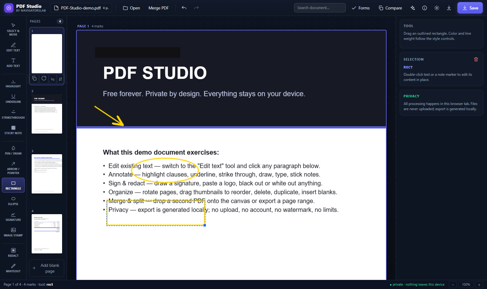
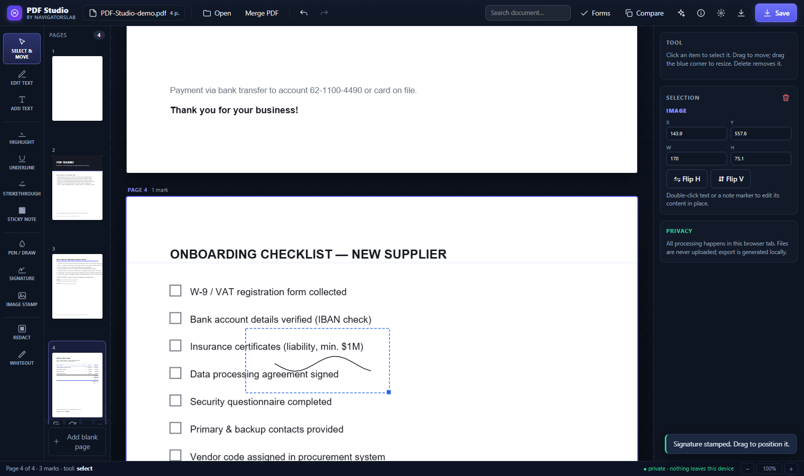
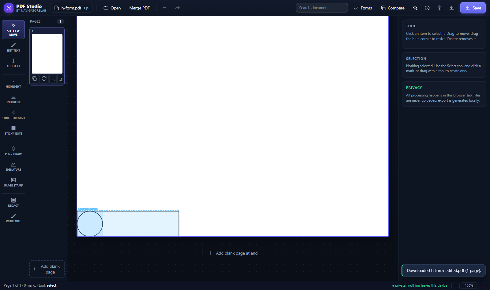
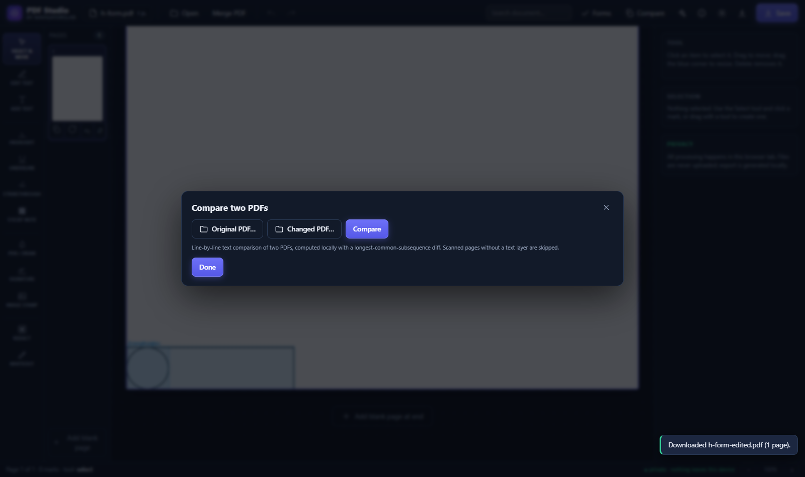
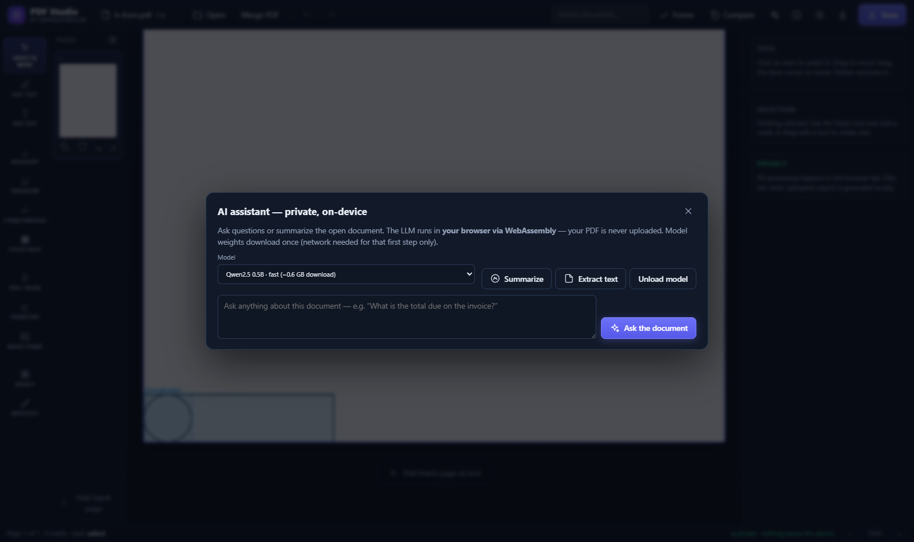
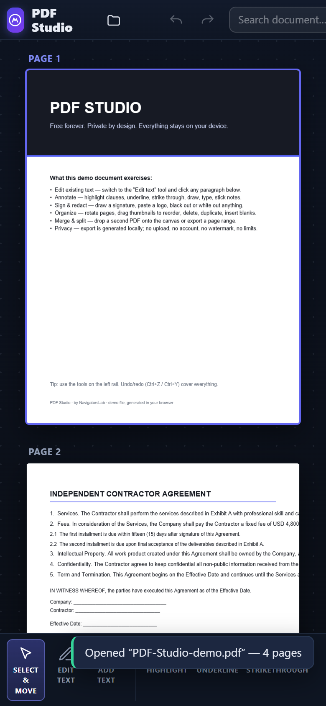

<div align="center">

# PDF Studio

**The free, open-source PDF editor that edits the text *inside* your PDF — entirely in your browser.**

**No uploads · No accounts · No watermarks · No page limits · No catch**

[](https://navigatorslab.com/pdf-studio/)
[](./LICENSE)
[](#for-developers)

> ⭐ **If this saves you an Adobe subscription, a star helps others find it.**


*Real recording: the tagline above is retyped live — the original text operators are rewritten in the file, not overlaid.*

</div>

---

## The problem

Every "free" PDF editor works the same way: upload your contract or your ID to somebody's server, edit three pages, then get hit with a paywall, a watermark, a page cap, or a sign-up screen the moment you press Save. Desktop editors that genuinely modify existing text cost a subscription.

## The fix

PDF Studio runs **100% in your browser**. Your files are opened, edited, and saved on your own machine — there is no server to upload to. And unlike every other free editor, it doesn't fake the editing: the Edit tool **rewrites the page's content stream itself**. The original text is deleted from the file and your replacement is written in as real vector text. Not an overlay. Not a text box on top. The old bytes are gone.

**Try it in 30 seconds:** [open the live app](https://navigatorslab.com/pdf-studio/), drop in any PDF, press `E`, click any line of existing text, retype it.

---

## What it does

| | |
|---|---|
| ✏️ **True text editing** | Click any line — or any table cell — and retype it. Exports as real vector text, searchable and print-crisp. |
| 📝 **Forms** | Fill real AcroForms (text, checkboxes, radios, dropdowns), then flatten them so nobody can change your answers. |
| 🖋️ **Sign & annotate** | Signature pad, highlight, pen, arrows, shapes, sticky notes, image stamps — all real vector content. |
| 🖤 **Redaction** | Burned-in black redaction, or invisible whiteout covers sampled from the page. What's covered stays covered. |
| 🔠 **OCR** | Scanned pages become editable text via on-device Tesseract (EN/ES/FR/DE). No upload, ever. |
| 🤖 **On-device AI** | Ask questions about your document; a real LLM runs in your browser via WebAssembly. Your data never leaves. |
| ⚖️ **Revision diff** | Drop in two versions, get a line-by-line diff. Did the payment terms change? Now you know. |
| 📄 **Pages** | Reorder, rotate, merge, split, duplicate, delete. Stamp page numbers, watermarks, headers & footers at export. |
| 📱 **Anywhere** | PWA — installs to your phone or desktop, works offline, autosaves and resumes your session. |

<details>
<summary><b>Screenshots</b> — every claim above, captured from the running app</summary>

<br>












</details>

---

## How it compares

Verified against public pricing/feature pages on 2026-09-27.

| | **PDF Studio** | Adobe Acrobat | Smallpdf | Sejda | Stirling PDF |
|---|---|---|---|---|---|
| Price | **Free, MIT open source** | ~$19.99/user/mo | $10–15/mo | ~$7.50/mo | Free (self-hosted) |
| True in-place text editing | **Yes** | Yes (paid) | Yes (paid) | Yes | Partial |
| Your document leaves your device | **Never** | Uploads to Adobe | Uploads to Smallpdf | Uploads (web) | Never (your server) |
| Daily / task caps | **None** | Paid tier | ~2 tasks/day | 3 tasks/day | None |
| Watermark on free output | **None** | — | Reported on some tools | None reported | None |
| Burned-in redaction | **Yes** | Yes (paid) | Paid | Whiteout-style | Yes |
| OCR | **Yes, on-device** | Paid | Paid | Capped | Yes |
| Revision diff | **Yes** | Yes (paid) | Paid | No | — |
| On-device AI Q&A | **Yes** | Paid add-on | Limited | No | No |
| Zero-setup (no install, no server) | **Yes** | — | Yes | Yes | No (Docker) |

**The short version:** incumbents upload your files and meter your work. Self-hosted tools make you run infrastructure. PDF Studio is the zero-setup app with the full feature list — free, no caps, no uploads.

---

## Privacy — absolute, by architecture

| Question | Answer |
|---|---|
| Where do my files go? | **Nowhere.** There is no upload endpoint. Open devtools and watch the network tab stay silent while you edit. |
| Is any of my data collected? | **No.** No accounts, no analytics on your documents. Sessions autosave **locally in your browser**. |
| What *does* download? | The app itself, plus optional public AI/OCR model weights (cached after first fetch). Your documents never transit the network. |
| Can I air-gap it? | **Yes.** Serve `dist/` on an internal network and point the model loaders at internal mirrors. |

---

## For developers

```bash
git clone https://github.com/Kayforkind/NavigatorsLab-PDF-Studio
cd NavigatorsLab-PDF-Studio
npm install
npm run dev        # http://localhost:5199
npm test           # 42 passing tests
npm run build      # → dist/ (relative base: works at domain root, subpath, or CDN)
```

**Stack:** TypeScript · React 19 · Vite · pdf.js (render) · pdf-lib (write) · Tesseract.js (OCR) · WebLLM (AI) · vite-plugin-pwa. **Zero backend.**

**The interesting engineering:** every mark lives in the page's PDF user space — the on-screen overlay and the exporter share the same CropBox-aware transform math (`src/lib/viewport.ts`), pinned in tests against pdf.js's own `PageViewport`, including offset MediaBox/CropBox origins that break most home-grown editors. Text edits go through a content-stream tokenizer: the original glyphs' show-text operators are deleted and replacements are written back with TJ kerning reproducing the original spacing. Tesseract, pdf.js workers, and WASM all run under a strict Content Security Policy with zero network calls for document data.

**Test suite (42):** document model ops & undo semantics · viewport parity with pdf.js at 0/90/180/270° · export round-trips re-parsed with pdf.js · LCS diff engine · content-stream tokenizer + deep text-rewrite/vector-redaction round-trips · table-cell hit splitting.

Good first issues are labeled [`good first issue`](https://github.com/Kayforkind/NavigatorsLab-PDF-Studio/labels/good%20first%20issue) — see [CONTRIBUTING.md](./CONTRIBUTING.md).

---

## Built by

**Kazim Raza** ([@Kayforkind](https://github.com/Kayforkind)) — creator of PDF Studio and founder of [NavigatorsLab](https://navigatorslab.com). He designed and built the content-stream text rewriting engine, burned-in vector redaction, per-cell table editing, the on-device OCR pipeline, and the in-browser AI integration.

> Note: early commits appear under the `kazim` git identity — same person; GitHub splits the two identities in the contributors graph.

---

## FAQ

- **Is it really free? What's the catch?** — Free, MIT-licensed, no catch. No accounts, no watermarks, no caps, no "pro" tier. Fork it, self-host it, ship it.
- **How is this different from other free PDF editors?** — They let you *annotate* (text boxes over content). PDF Studio rewrites the content stream: original text operators are deleted from the file, replacements written in as real vector text.
- **Honest limits?** — Text editing needs a text layer (flat scans go through the OCR tool). Replacement text uses Helvetica metrics — near-identical, not glyph-perfect, on exotic embedded fonts. The on-device AI runs small models (0.5B–1B): great at summarizing your document, not a frontier model.

---

## License

**MIT** — free for personal, commercial, and everything in between. That's the whole point: [LICENSE](./LICENSE).

<div align="center">

**Free. Open source. Private by architecture, not by policy.**

[use it live](https://navigatorslab.com/pdf-studio/) · [navigatorslab.com](https://navigatorslab.com)

</div>
