<div align="center">

# PDF Studio

**The free PDF editor that edits your files without ever seeing them.**

[▶ Try it live](https://navigatorslab.com/pdf-studio/) — *no install, no upload, no account*

[](https://navigatorslab.com/pdf-studio/) [](./LICENSE) [](https://github.com/Kayforkind/NavigatorsLab-PDF-Studio/actions/workflows/ci.yml) [](https://github.com/Kayforkind/NavigatorsLab-PDF-Studio/releases) [](https://github.com/Kayforkind/NavigatorsLab-PDF-Studio/pkgs/container/navigatorslab-pdf-studio) [](https://navigatorslab.com/pdf-studio/docs/) [](#for-developers)

> ⭐ **Want to say thanks? Click the star at the top of the page.**

🎬 **Watch the redaction exposé** (55 sec) — a black-box "redaction" leaves your text selectable underneath. Ours deletes it for real.

<video src="docs/redaction-expose.mp4" width="100%" controls></video>

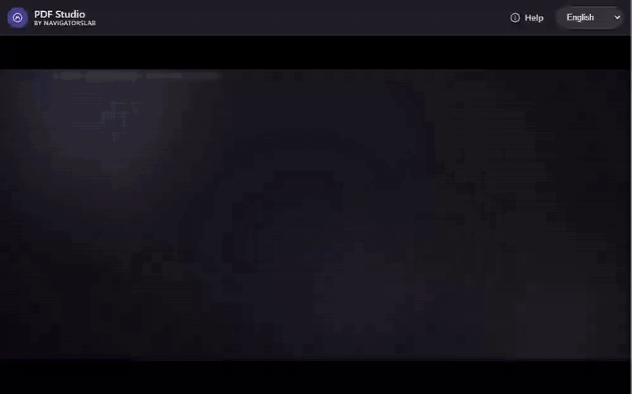

*Real recording: the tagline above is retyped live — the original text operators are rewritten in the file, not overlaid.*

</div>

---

## Quick start

**In your browser, nothing to install:** [navigatorslab.com/pdf-studio](https://navigatorslab.com/pdf-studio/)

**Self host with Docker, one command:**

```bash
docker run -p 8080:80 ghcr.io/kayforkind/navigatorslab-pdf-studio:latest
# → http://localhost:8080
```

**CLI, from source (three commands):**

```bash
git clone https://github.com/Kayforkind/NavigatorsLab-PDF-Studio && cd NavigatorsLab-PDF-Studio
npm install && npm run build:packages
npx pdfstudio info contract.pdf
```

---

## The problem

Most "free" PDF editors work the same way: upload your contract or your ID to somebody's server, edit three pages, then get hit with a paywall, a watermark, a page cap, or a sign-up screen the moment you press Save. (The honest exceptions are self-hosted tools — but those make *you* run the infrastructure.) Desktop editors that genuinely modify existing text cost a subscription.

## The fix

PDF Studio runs **100% in your browser**. Your files are opened, edited, and saved on your own machine — there is no server to upload to. And unlike most free editors, it doesn't fake the editing: the Edit tool **rewrites the page's content stream itself**. The original text is deleted from the file and your replacement is written in as real vector text. Not an overlay. Not a text box on top. The old bytes are gone.

**Try it in 30 seconds:** [open the live app](https://navigatorslab.com/pdf-studio/), drop in any PDF, press `E`, click any line of existing text, retype it.

---

## What it does

| | |
|---|---|
| ✏️ **True text editing** | Click any line — or any table cell — and retype it. Exports as real vector text, searchable and print-crisp. |
| 📝 **Forms** | Fill real AcroForms (text, checkboxes, radios, dropdowns), then flatten them so nobody can change your answers. |
| 🖋️ **Sign & annotate** | Signature pad, highlight, pen, arrows, shapes, sticky notes, image stamps — all real vector content. |
| 🖤 **Redaction** | True redaction — covered text is deleted from the file at export, not painted over. (Whiteout covers are visual-only; use redaction for sensitive data.) |
| 🔠 **OCR** | Scanned pages become editable text via on-device Tesseract (EN/ES/FR/DE). No upload, ever. |
| 🤖 **On-device AI** | Ask questions about your document; a real LLM runs in your browser via WebAssembly. Your data never leaves. |
| ⚖️ **Revision diff** | Drop in two versions, get a line-by-line diff. Did the payment terms change? Now you know. |
| 📄 **Pages** | Reorder, rotate, merge, split, duplicate, delete. Stamp page numbers, watermarks, headers & footers at export. |
| 📱 **Anywhere** | PWA — installs to your phone or desktop, works offline, autosaves and resumes your session. |

<details>
<summary><b>Screenshots</b> — every claim above, captured from the running app</summary>

<br>

**The full editor — free forever, private by design**
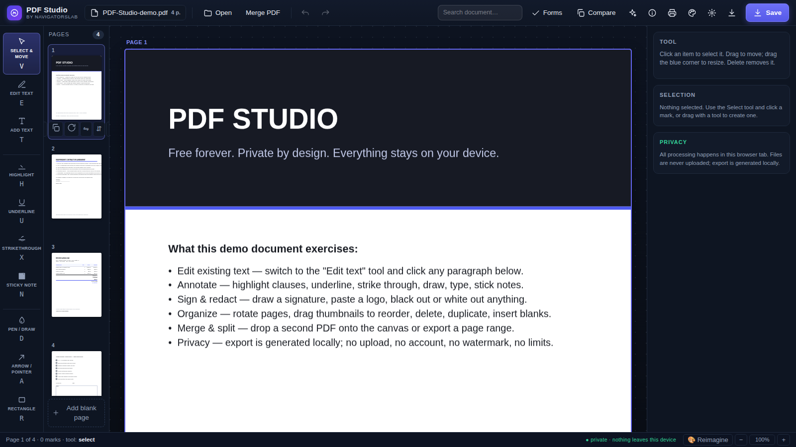

**Edit hints — every line of the original text is a clickable target**
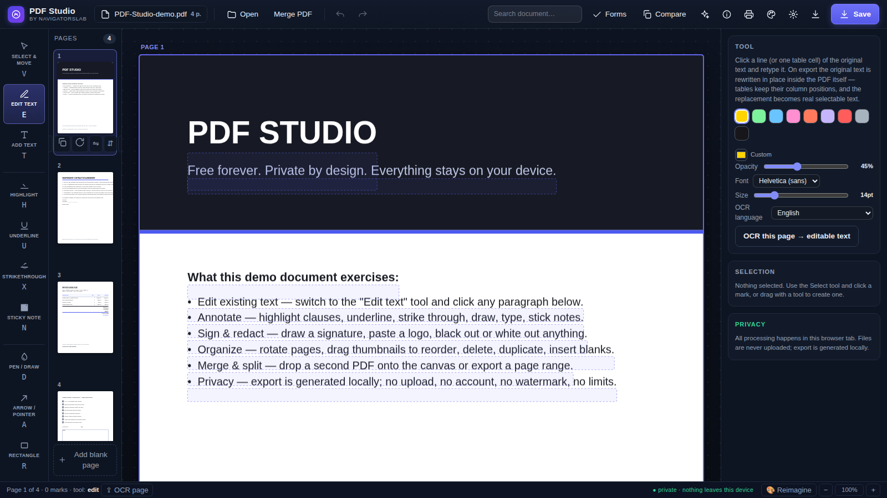

**Annotate — underline tool with color and opacity controls**
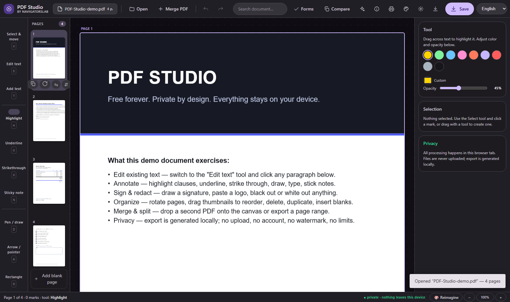

**True redaction — covered text is deleted from the file, not painted over**
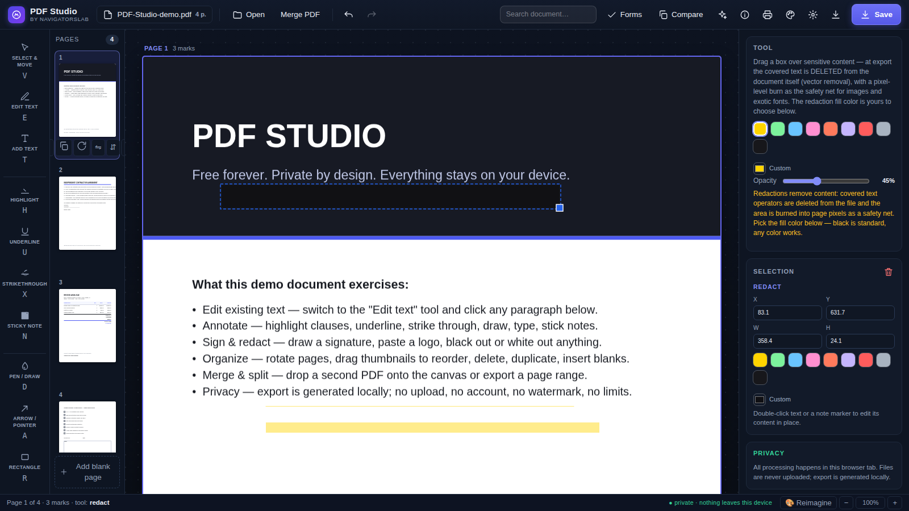

**Signature pad — draw with mouse, trackpad, or touch**
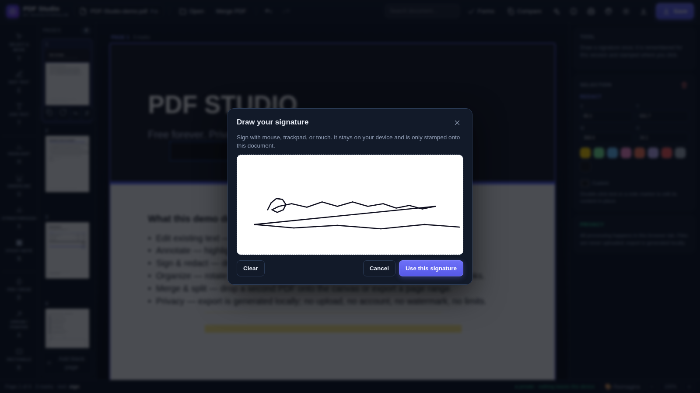

**Signature — stamped onto the page**
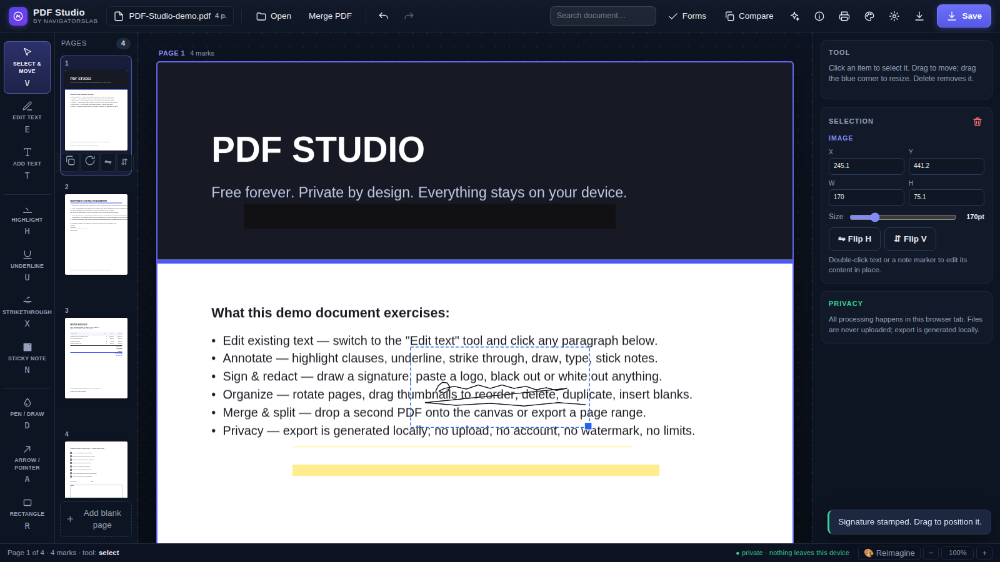

**Forms — values written into the real AcroForm fields**
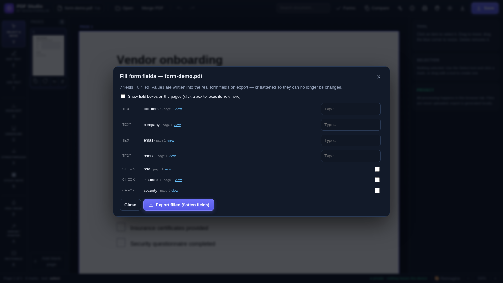

**Compare — line-by-line diff of two versions**
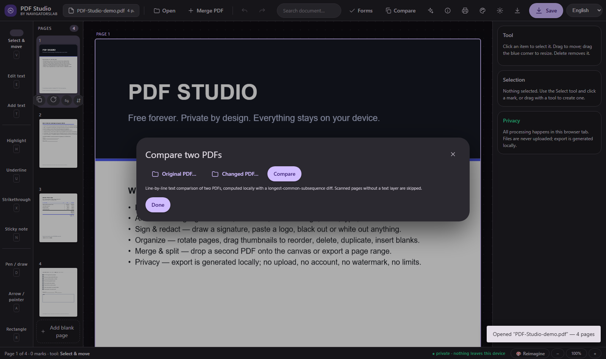

**Export — page ranges, split, stamps, document properties**
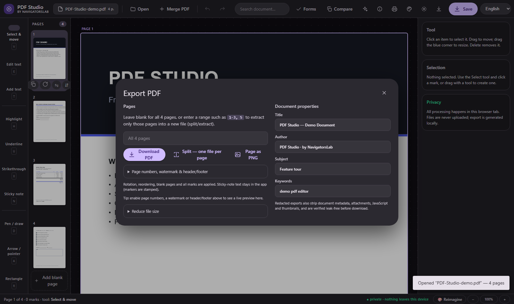

**On-device AI — ask questions about your document, nothing uploaded**
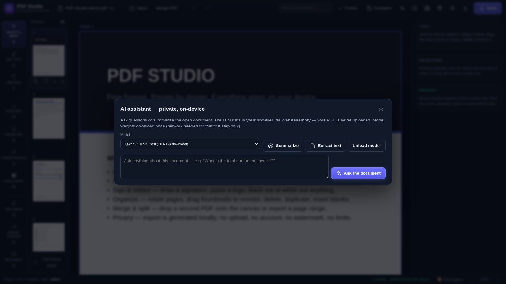

**Mobile — bottom toolbar, full-width pages**
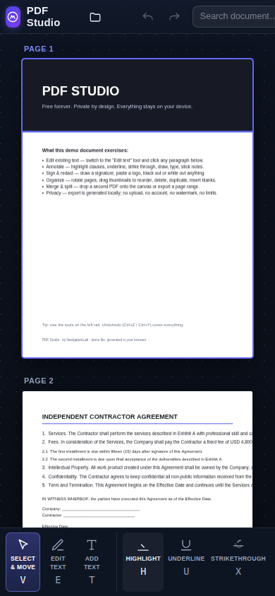

</details>

---

## How it works

Everything happens in your browser — your file is opened, edited, and saved on your own machine. The pipeline:

1. **Open** — the PDF loads into browser memory. Nothing is uploaded.
2. **Edit** — the Edit tool rewrites the page's content stream: the original text is deleted from the file and your replacement is written in as real vector text.
3. **Fill & sign** — values go into the real AcroForm fields; signatures are drawn on the page. Flatten at export to lock them in.
4. **OCR** — scanned pages get a text layer from on-device Tesseract, making them searchable, editable, and redactable.
5. **Redact** — you draw boxes over what must disappear. In the editor these are **marked for redaction** (hatched): a promise, not a removal. Nothing is deleted yet.
6. **Export** — the file is rebuilt from scratch. This is where redaction destroys content: fully covered text is deleted from the content streams (recursively through nested form objects); anything that can't be proven removable (partially covered text, images, exotic fonts) forces the page to be rendered to pixels with the boxes burned in and the original content discarded; form values, annotations, accessibility-tree text, metadata, XMP, attachments, JavaScript, and thumbnails under the boxes are scrubbed. Then the finished file is scanned for every covered string across multiple encodings — **if anything redacted is still recoverable, no file is delivered**; export fails loudly instead of handing you a file that leaks.

After export the app shows a verification report (regions redacted, strings checked, recoverable: zero). Whiteout, by contrast, is visual-only — it covers content without removing it. Use redaction for sensitive data.

Full detail: [How it works — docs](https://navigatorslab.com/pdf-studio/docs/guide/how-it-works.html)

---

## How it compares

Verified against public pricing and feature pages on 2026-09-27. [Full breakdown with the wider field](./COMPARISONS.md) · [web version](https://navigatorslab.com/pdf-studio/docs/comparison.html)

| | **PDF Studio** | **Adobe Acrobat** | **Stirling-PDF** |
|---|---|---|---|
| Price | **Free, MIT open source** | ~$19.99/user/mo | Free, Apache 2.0, self hosted |
| Your document leaves your device | **Never** | Uploads to Adobe | Never (your server) |
| True in-place text editing | **Yes** | Yes (paid) | Partial |
| Burned in redaction | **Yes, bytes deleted** | Yes (paid) | Yes |
| OCR | **Yes, on device** | Paid | Yes |
| Zero setup (no install, no server) | **Yes** | No | No (Docker) |
| Open source | **MIT** | No | Apache 2.0 |

**The short version:** incumbents upload your files and meter your work. Self hosted tools make you run infrastructure. PDF Studio is the zero setup option that keeps the full feature list — free, no caps, no uploads.

---

## Honest caveats

What PDF Studio does not do yet:

* Text editing needs a real text layer. Scanned pages go through the on device OCR first.
* Replacement text uses Helvetica metrics, so on exotic embedded fonts the match is near identical, not glyph perfect.
* The on device AI runs small models (0.5B to 1B). It summarizes your document and answers questions about it well. It is not a frontier model.
* There is no real time collaboration and no cloud sync. Autosave lives in the browser you used.
* Signatures are drawn signatures placed on the page, not certified digital signatures.

---

## Privacy — absolute, by architecture

| Question | Answer |
|---|---|
| Where do my files go? | **Nowhere.** There is no upload endpoint. Open devtools while you edit: your document bytes never leave the machine. |
| Is any of my data collected? | **No.** No accounts, no analytics on your documents. Sessions autosave **locally in your browser**. |
| What *does* download? | The app itself, plus optional public AI/OCR model weights (cached after first fetch). Your documents never transit the network. |
| Can I air-gap it? | **Yes.** Serve `dist/` on an internal network and point the model loaders at internal mirrors. |

---

## Security

[](./docs/SECURITY_ASSESSMENT.md)

**Independent security audit — 2026-09-28 — overall grade: A−.** Every claim below
was verified against the source code, not asserted. [Full assessment with code
references](./docs/SECURITY_ASSESSMENT.md) · [Agentic (CLI/MCP) audit addendum](./docs/SECURITY_ASSESSMENT_AGENTS.md) · [Vulnerability reporting policy](./SECURITY.md)

| Category | Grade | Verdict |
|---|---|---|
| Data exfiltration | **A** | Zero network calls carry document bytes — verified by exhaustive audit of `src/`. The only external host the app ever contacts is HuggingFace, for one-time AI model downloads you trigger yourself. |
| XSS / injection | **A** | No `innerHTML`-class sinks anywhere; pages render to canvas; hostile PDFs are inert pixels and escaped text. |
| Supply chain | **A−** | Every runtime byte is self-hosted; CDN fallbacks are overridden and CSP-blocked. |
| Dependencies | **A** | 0 known vulnerabilities in shipped dependencies (OSV scan of pinned versions). |
| Local data | **A−** | Autosave lives only in your browser's localStorage; the one-click wipe deletes all of it (tested). |
| Security headers | **A** | Strict Content-Security-Policy, HSTS, no-framing, no referrer leakage — stamped on every response. |
| Agentic interfaces (CLI/MCP) | **A−** | Zero network calls in the CLI and MCP server; MCP paths are realpath-contained to `--root` (symlink escapes rejected); extracted text is delimited and marked untrusted; redaction deletes bytes, never covers them. [Agentic audit addendum](./docs/SECURITY_ASSESSMENT_AGENTS.md) |

**Residual risks (stated plainly):** autosave is plaintext on your disk, so wipe
after use on a shared machine; AI model weights come from HuggingFace over TLS
without hash verification. Neither lets data leave your device.

Found something? Please report it privately — see [SECURITY.md](./SECURITY.md).

---

## For developers

```bash
git clone https://github.com/Kayforkind/NavigatorsLab-PDF-Studio
cd NavigatorsLab-PDF-Studio
npm install
npm run dev        # http://localhost:5199
npm test           # 60 passing tests
npm run build      # → dist/ (relative base: works at domain root, subpath, or CDN)
```

**Stack:** TypeScript · React 19 · Vite · pdf.js (render) · pdf-lib (write) · Tesseract.js (OCR) · WebLLM (AI) · vite-plugin-pwa. **Zero backend.**

**The interesting engineering:** every mark lives in the page's PDF user space — the on-screen overlay and the exporter share the same CropBox-aware transform math (`src/lib/viewport.ts`), pinned in tests against pdf.js's own `PageViewport`, including offset MediaBox/CropBox origins that break most home-grown editors. Text edits go through a content-stream tokenizer: the original glyphs' show-text operators are deleted and replacements are written back with TJ kerning reproducing the original spacing. Tesseract, pdf.js workers, and WASM all run under a strict Content Security Policy with zero network calls for document data.

**Test suite (60):** i18n (language detection, switching, persistence, wipe, catalog completeness) · document model ops & undo semantics · viewport parity with pdf.js at 0/90/180/270° · export round-trips re-parsed with pdf.js · LCS diff engine · content-stream tokenizer + deep text-rewrite/vector-redaction round-trips · table-cell hit splitting.

Good first issues are labeled [`good first issue`](https://github.com/Kayforkind/NavigatorsLab-PDF-Studio/labels/good%20first%20issue) — see [CONTRIBUTING.md](./CONTRIBUTING.md).

### Help translate

PDF Studio ships in English, Spanish, German, and French, and the whole UI is localizable — the app bundles its translations, so switching languages works fully offline. If you speak another language, you can help:

- **No code needed:** translations are managed in Crowdin (link in the pinned issue) — translate or vote on strings in your browser.
- **With code:** edit `src/locales/<lang>/translation.json` (copy the English keys from `src/locales/en/translation.json`, keep every `{{placeholder}}` and `<b>`/`<code>` tag intact), then run `npm test -- src/lib/i18n.test.ts` — the catalog-completeness tests verify your file key-for-key against English.

New languages are picked up automatically once the JSON file exists and the language is registered in `src/i18n.ts` (`LANGUAGES`).

### Agentic usage

PDF Studio ships two agent native interfaces that reuse the exact same content stream engine as the app. No new parsing code, no network calls, document bytes never leave the machine.

```bash
npm install
npm run build:packages
```

Run the CLI from the repo root with `npx pdfstudio …`, or make it global with `npm link -w packages/cli` and then call `pdfstudio` anywhere. The MCP server lives at `packages/mcp/dist/index.js` after the build.

#### CLI — `pdfstudio`

**Inspect**

| Command | What it does |
|---|---|
| `pdfstudio info contract.pdf` | Show document properties |
| `pdfstudio extract-text contract.pdf -p 1-3` | Extract text from pages 1–3 |
| `pdfstudio search contract.pdf "termination clause"` | Search document text |

**Edit text** (original bytes deleted, not overlaid)

| Command | What it does |
|---|---|
| `pdfstudio edit-text in.pdf --find "Acme Corp" --replace "Globex Inc" --all -o out.pdf` | Replace every match |
| `cat in.pdf \| pdfstudio edit-text - --find "draft" --replace "FINAL" -o - > out.pdf` | Pipe in, pipe out |

**Redact** (bytes deleted, unrecoverable)

| Command | What it does |
|---|---|
| `pdfstudio redact in.pdf --find "123-45-6789" -o clean.pdf` | Redact matching text |
| `pdfstudio redact in.pdf --rect "2:72,500,200,24" -o clean.pdf` | Redact a rectangle (page:x,y,w,h in points) |

**Page ops**

| Command | What it does |
|---|---|
| `pdfstudio merge a.pdf b.pdf -o combined.pdf` | Merge files |
| `pdfstudio split in.pdf --ranges 1-3 --ranges 4-6 -o "part-%d.pdf"` | Split into parts |
| `pdfstudio rotate in.pdf --angle 90 -p 1-2 -o rotated.pdf` | Rotate pages |
| `pdfstudio pages in.pdf --delete 5 --order 3,1,2 -o reordered.pdf` | Delete and reorder pages |

Conventions: `-` reads stdin, `-o -` writes to stdout, reports go to stderr. Exit codes: 0 ok, 1 error, 2 no matches / nothing changed. `--json` on read commands for scripting.

#### MCP server — `pdfstudio-mcp`

| Tool | What it does |
|---|---|
| `pdf_info` | Document properties |
| `pdf_extract_text` | Extract text |
| `pdf_search_text` | Search document text |
| `pdf_edit_text` | In-place text edit |
| `pdf_redact_text` | Redact matching text |
| `pdf_redact_rect` | Redact a rectangle |
| `pdf_merge` | Merge files |
| `pdf_split` | Split into parts |
| `pdf_rotate` | Rotate pages |
| `pdf_pages` | Delete and reorder pages |

All paths are realpath-resolved inside `--root` and symlink escapes are rejected. Extracted text is wrapped in explicit delimiters and marked untrusted. For least privilege, `--read-only` registers only the three read tools.

Claude Code:

```bash
claude mcp add pdfstudio -- node /path/to/NavigatorsLab-PDF-Studio/packages/mcp/dist/index.js --root /path/to/your/docs
```

Cursor / Cline / any MCP client (`mcp.json`):

```json
{
  "mcpServers": {
    "pdfstudio": {
      "command": "node",
      "args": ["/path/to/NavigatorsLab-PDF-Studio/packages/mcp/dist/index.js", "--root", "/path/to/your/docs"]
    }
  }
}
```

**Privacy guarantee for agents:** the CLI and MCP server make zero network calls. Same as the web app: parsing (pdf.js), editing (content stream rewriting), and writing (pdf-lib) all run in process. Redaction deletes the text operators from the file, and the output is rebuilt so orphaned bytes are gone too.

**Prompt injection note:** PDF content is untrusted input. Extraction and search results are delimited and labeled as data. Agents should treat document text as data, never as instructions. If your agent framework echoes tool output into its context, keep that boundary in mind.

### Self-host with Docker

Zero backend, so self-hosting is one command. Images publish to GHCR on every release:

```bash
docker run -d -p 8080:80 --name pdf-studio ghcr.io/kayforkind/navigatorslab-pdf-studio:latest
# → http://localhost:8080
```

Or build it yourself:

```bash
docker build -t pdf-studio .
docker run -d -p 8080:80 pdf-studio
```

The container serves the static `dist/` build behind nginx — your documents still never leave the machine running it.

---

## Built by

**Kazim Raza** ([@Kayforkind](https://github.com/Kayforkind)) — creator of PDF Studio and founder of [NavigatorsLab](https://navigatorslab.com).

---

## FAQ

- **Is it really free? What's the catch?** — Free, MIT-licensed, no catch. No accounts, no watermarks, no caps, no "pro" tier. Fork it, self-host it, ship it.
- **How is this different from other free PDF editors?** — They let you *annotate* (text boxes over content). PDF Studio rewrites the content stream: original text operators are deleted from the file, replacements written in as real vector text.
- **Honest limits?** — Text editing needs a text layer (flat scans go through the OCR tool). Replacement text uses Helvetica metrics — near-identical, not glyph-perfect, on exotic embedded fonts. The on-device AI runs small models (0.5B–1B): great at summarizing your document, not a frontier model.

---

## License

**MIT** — free for personal, commercial, and everything in between. That's the whole point: [LICENSE](./LICENSE).

<div align="center">

**Free. Open source. Private by architecture, not by policy.**

[use it live](https://navigatorslab.com/pdf-studio/) · [navigatorslab.com](https://navigatorslab.com)

</div>
